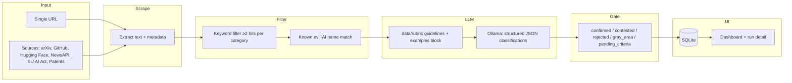

# Evil AI Scraper v2

An automated research pipeline for identifying and classifying AI systems that meet evidence-based harm criteria, developed by **MIT Critical Data** as part of the **AI for Evil** initiative.

The app ingests content from URLs or built-in sources, applies a high-recall keyword filter and known-system name hints, then classifies with a local **Ollama** LLM against a 15-subcategory rubric. Results appear in a dark-mode web dashboard (runs, documents, per-classification fields, confidence, and gates).

---

## Classification categories

Five harm areas with three subcategories each (codes `1A`–`5C`). Full scoring rules live in [`data/rubric/guidelines.txt`](data/rubric/guidelines.txt). Gray-area subcategories (`2B`, `5B`) and criteria still under review (`3C`, `5A`) are handled with special statuses in the pipeline.

| # | Area | Subcategories |
|---|------|----------------|
| 1 | Information & perception manipulation | Disinformation · Synthetic media · Narrative amplification |
| 2 | Exploitation & manipulation | Predatory targeting · Addiction optimization · Financial extraction |
| 3 | Surveillance & control | Mass surveillance · Predictive suppression · Social scoring |
| 4 | Cyber & infrastructure harm | Automated cyberattack tools · Infrastructure disruption · Autonomous weaponization |
| 5 | Institutional & structural manipulation | Metric gaming · Market manipulation · Accountability evasion |

---

## Architecture (current)

| Layer | Technology |
|-------|------------|
| Web app | [FastAPI](https://fastapi.tiangolo.com/) + [Jinja2](https://jinja.palletsprojects.com/) templates, static CSS/JS |
| Database | [SQLite](https://www.sqlite.org/) via SQLAlchemy (default file: `data/evil_ai.db`) |
| Scraping | [httpx](https://www.python-httpx.org/), [trafilatura](https://trafilatura.readthedocs.io/), BeautifulSoup |
| Classification | Keyword dictionary + optional **known-name** map, then **Ollama** JSON chat API |
| Curated examples | [`data/rubric/examples.csv`](data/rubric/examples.csv) → few-shot text in the LLM prompt + extra name aliases (see below) |



**Pipeline behavior (simplified):**

1. **Scrape** — One URL (`URLScraper`) or batch sources (`ArxivScraper`, `GitHubScraper`, etc.).
2. **Keyword filter** — Per subcategory dictionaries in `backend/pipeline/classifier.py`; a category matches if at least two keywords appear in the document (plus URL/title enrichment).
3. **Name hints** — Built-in map plus non-conflicting entries derived from `data/rubric/examples.csv` tool names (substring match on normalized names).
4. **LLM** — If keywords matched or `AI_EVIL_USE_LLM=true`, the document is sent to Ollama with `data/rubric/guidelines.txt` and an optional **curated examples** block from the CSV.
5. **Confidence gate** — `≥0.70` confirmed, `0.40–0.69` contested, below `0.40` rejected (with overrides for gray/pending subcategories).

---

## Repository layout

```
evil-ai-scraper/
├── run.py                 # Uvicorn entry (default port 8001)
├── requirements.txt
├── data/
│   ├── rubric/
│   │   ├── guidelines.txt # Rubric for the LLM
│   │   └── examples.csv   # Curated rows → few-shot prompt + name aliases
│   └── evil_ai.db         # SQLite (runtime; gitignored — not in repo)
├── backend/
│   ├── app.py             # Routes, API, templates
│   ├── config.py          # Env-backed settings
│   ├── database.py
│   ├── models.py
│   ├── pipeline/
│   │   ├── classifier.py  # Keywords, Ollama, gates
│   │   ├── examples_csv.py # Load examples CSV
│   │   └── processor.py   # Scrape → classify → store
│   └── scrapers/          # URL, arXiv, GitHub, Hugging Face, NewsAPI, EU AI Act, Patents
└── frontend/
    ├── templates/         # index.html, run_detail.html, …
    └── static/            # style.css, app.js
```

---

## Getting started

### Prerequisites

- **Python 3.11+** (3.12 works)
- **[Ollama](https://ollama.com/)** running locally (or reachable at `OLLAMA_BASE_URL`)
- A model pulled to match `.env`, for example:
  ```bash
  ollama pull llama3.1:8b
  ```

### Install and run

```bash
cd evil-ai-scraper-2
python3 -m venv .venv
source .venv/bin/activate   # Windows: .venv\Scripts\activate
pip install -r requirements.txt
```

Create a **`.env`** file in the project root (optional; defaults exist). See [Configuration](#configuration).

Start the server:

```bash
python3 run.py
```

Open **http://localhost:8001** — dashboard at `/`, each run at `/run/{id}`.

---

## Web UI

- **Dashboard** — Start a URL scrape or multi-source scrape; list recent runs.
- **Run detail** — Metrics, category/source charts, top threats, and **All Findings** with search, filters (status, source), sort (default: highest confidence first), and expandable document/classification blocks.
- **In-progress runs** — Loading overlay while the pipeline runs; page polls until completion.

---

## Configuration

Environment variables are read from **`.env`** in the project root (`backend/config.py`).

| Variable | Default | Purpose |
|----------|---------|---------|
| `OLLAMA_BASE_URL` | `http://localhost:11434` | Ollama API |
| `OLLAMA_MODEL` | `llama3.1:8b` | Chat model |
| `SQLITE_URL` | `sqlite:///…/data/evil_ai.db` | SQLAlchemy URL |
| `NEWS_API_KEY` | *(empty)* | NewsAPI scraper |
| `SCRAPE_USER_AGENT` | `AIForEvilResearchBot/1.0` | HTTP client User-Agent |
| `SCRAPE_DELAY_SECONDS` | `2` | Delay between scraper requests |
| `AI_EVIL_USE_LLM` | `true` | Set `false` for keyword-only fallback |
| `CONFIDENCE_CONFIRMED_THRESHOLD` | `0.70` | Confirmed cutoff |
| `CONFIDENCE_REJECTED_THRESHOLD` | `0.40` | Below = rejected band |
| `LLM_MAX_TOKENS` | `6000` | Ollama generation cap |
| `GUIDELINES_VERSION` | `1` | Stored on classifications |
| `AI_EVIL_GUIDELINES_PATH` | `data/rubric/guidelines.txt` | Rubric file (relative to project root) |
| `AI_EVIL_EXAMPLES_CSV` | `data/rubric/examples.csv` | Curated CSV path |
| `AI_EVIL_USE_EXAMPLES_CSV` | `true` | Disable few-shot + CSV-only aliases |
| `AI_EVIL_EXAMPLES_PROMPT_MAX_CHARS` | `6000` | Max size of examples block in system prompt |

Restart the app after changing `data/rubric/examples.csv` (examples are cached in memory until process restart).

---

## `data/rubric/`

- **`guidelines.txt`** — Rubric text passed to the LLM.
- **`examples.csv`** — Curated spreadsheet. The pipeline:

1. Appends a **compact few-shot block** (subcategory, stance, tool, harm, evidence) to the LLM system prompt after the guidelines file.
2. Adds **name aliases** for tool names (first segment before `/`, alphanumeric key → subcategory) into the known-name map **without** overriding built-in entries in `classifier.py`.

Edit the CSV to improve calibration; keep the header row and column layout consistent with existing rows.

Upstream project: [github.com/ai-for-evil/evil-ai-scraper](https://github.com/ai-for-evil/evil-ai-scraper).

---

## API (JSON)

| Method | Path | Purpose |
|--------|------|---------|
| `POST` | `/api/scrape/url` | Body: `{"url": "…"}` → starts run |
| `POST` | `/api/scrape/sources` | Body: `{"sources": ["arxiv", …]}` |
| `GET` | `/api/run/{id}` | Run status and counts (used by polling UI) |
| `GET` | `/api/runs` | List recent runs (JSON) |

---

## Tech stack (actual dependencies)

See [`requirements.txt`](requirements.txt): FastAPI, Uvicorn, SQLAlchemy, python-dotenv, httpx, trafilatura, beautifulsoup4, Jinja2, aiofiles, lxml.

---

## Research context

This pipeline supports an evidence-based, auditable record of harmful AI deployments. The rubric and tooling evolve with the project; see [`CONTEXT.md`](CONTEXT.md) for current notes and known follow-ups.

For questions about the research, contact the **MIT Critical Data** team.
